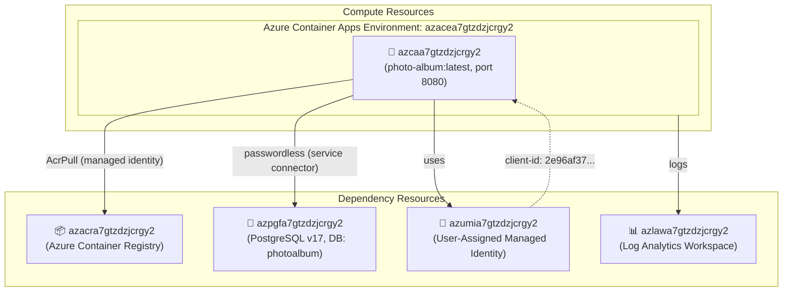

# Deployment Summary: 005-deployment-azure-container-apps

## Status: ✅ Deployment Successful

**Project**: PhotoAlbum-Java (Spring Boot 3.5.14 / Java 21)
**Target**: Azure Container Apps (Consumption plan)
**Region**: centralus
**Date**: 2026-05-28

---

## Application URL

**🌐 https://azcaa7gtzdzjcrgy2.agreeablecoast-b37cabbd.centralus.azurecontainerapps.io**

---

## Provisioned Azure Resources

| Resource Type | Name | Region | Details |
|---|---|---|---|
| Resource Group | `photoalbum-rg` | centralus | All resources contained here |
| User-Assigned Managed Identity | `azumia7gtzdzjcrgy2` | centralus | Client ID: 2e96af37-0b72-4d6a-9d39-e5738ff6693b |
| Log Analytics Workspace | `azlawa7gtzdzjcrgy2` | centralus | Retention: 30 days |
| Azure Container Registry | `azacra7gtzdzjcrgy2` | centralus | azacra7gtzdzjcrgy2.azurecr.io |
| ACR AcrPull Role Assignment | (built-in) | centralus | MI → ACR (7f951dda) |
| Container Apps Environment | `azacea7gtzdzjcrgy2` | centralus | Consumption, Log Analytics connected |
| PostgreSQL Flexible Server | `azpgfa7gtzdzjcrgy2` | centralus | v17, Standard_B1ms, DB: photoalbum |
| Azure Container App | `azcaa7gtzdzjcrgy2` | centralus | photo-album:latest, Port 8080 |
| Service Connector | `photoalbum_pg_connection` | N/A | Container App → PostgreSQL via MI |

---

## Architecture Diagram

---

## Deployment Files

| File | Description |
|---|---|
| `infra/main.bicep` | Subscription-scope Bicep entry point (creates RG, calls module) |
| `infra/main.parameters.json` | Bicep deployment parameters (no secrets) |
| `infra/modules/resources.bicep` | All Azure resources: MI, Log Analytics, ACR, ACA Env, PostgreSQL, Container App |
| `infra/deploy.ps1` | Windows PowerShell provisioning script (Bicep + Service Connector) |
| `infra/deploy.sh` | Linux/macOS Bash provisioning script (Bicep + Service Connector) |
| `infra/infra-config.md` | Machine-readable provisioned resource summary |
| `infra/compliance.md` | IaC rules compliance report |
| `infra/README.md` | Infrastructure documentation |
| `deploy-scripts/deploy.ps1` | App deployment script (ACR build + Container App update) |

---

## Key Technical Decisions

| Decision | Choice | Reason |
|---|---|---|
| Auth method | User-Assigned Managed Identity | Passwordless, no secrets in config |
| DB connection | Service Connector (springBoot) | Auto-configures Spring datasource env vars |
| Image build | `az acr build` | Serverless build, no local Docker required |
| Image | `azacra7gtzdzjcrgy2.azurecr.io/photo-album:latest` | Pushed via ACR build task |
| Env var fix | ARM REST API PATCH | CLI extension 1.2.0b1 had bug with --set-env-vars |

---

## Subscription Information

| Property | Value |
|---|---|
| Subscription ID | `6c933f90-8115-4392-90f2-7077c9fa5dbd` |
| Resource Group | `photoalbum-rg` |
| Location | `centralus` |
