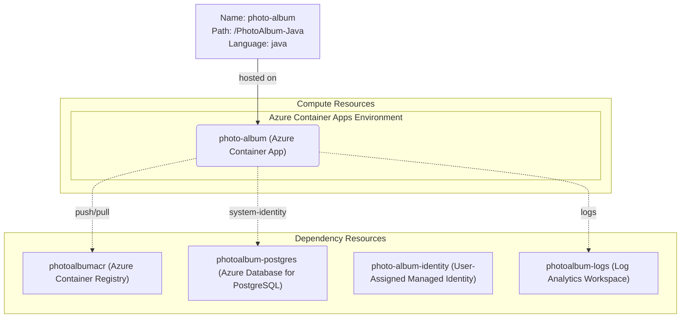

# Azure Deployment Plan for PhotoAlbum-Java Project

## **Goal**
Deploy the PhotoAlbum-Java Spring Boot application to Azure Container Apps in an Azure Resource Group using Bicep IaC and AzCLI.

## **Project Information**

**PhotoAlbum-Java**
- **Stack**: Java 21, Spring Boot 3.5.14, Maven
- **Type**: Photo storage and gallery web application (Thymeleaf + REST API)
- **Containerization**: Dockerfile present at repository root (multi-stage Maven build → OpenJDK 21 JRE)
- **Dependencies**: Azure Database for PostgreSQL (Flexible Server) via Managed Identity (passwordless)
- **Hosting**: Azure Container Apps
- **Auth**: Spring Cloud Azure Managed Identity (`spring-cloud-azure-starter-jdbc-postgresql`)

## **Azure Resources Architecture**

> **Install the mermaid extension in IDE to view the architecture.**

## **Existing Azure Resources**

No existing Azure resources found. All resources will be provisioned via Bicep IaC.

**Required Resources:**
| Resource Type | Name | SKU | Purpose |
|---|---|---|---|
| Resource Group | photoalbum-rg | N/A | Container for all resources |
| Container Registry | photoalbumacr | Basic | Store Docker images |
| Container Apps Environment | photoalbum-env | Consumption | Host container apps |
| Container App | photo-album | Consumption | Host the application |
| Azure Database for PostgreSQL | photoalbum-postgres | Flexible Server B1ms | Application database |
| User-Assigned Managed Identity | photo-album-identity | N/A | Passwordless DB auth |
| Log Analytics Workspace | photoalbum-logs | PerGB2018 | Container app logs |

## **Execution Steps**

> **Below are the steps for Copilot to follow; ask Copilot to update or execute this plan. Add check list for the steps.**
> **CRITICAL: Do NOT run 'az login' until 'Env setup' step.**

1. - [x] **Containerization**
   - Dockerfile present at: `./Dockerfile` (multi-stage build, Java 21, port 8080)
   - Output: `./Dockerfile`

2. - [ ] **Env Setup for AzCLI**
   1. Install AZ CLI if not installed
   2. Verify logged-in subscription (`az account show`)
   3. Install Service Connector extension: `az extension add --name serviceconnector-passwordless --upgrade`

3. - [ ] **Provisioning (Bicep IaC)**
   - Use `infrastructure-bicep-generation` skill to generate Bicep IaC files under `./infra/`
   - Provision: Resource Group, Container Registry, Log Analytics, Container Apps Environment, Container App, PostgreSQL Flexible Server, User-Assigned Managed Identity
   - Run: `az deployment sub create` or `az deployment group create`

4. - [ ] **Check Azure Resources Existence**
   1. Container Registry: `az acr show -o json`
   2. Container Apps Environment: `az containerapp env show -o json`
   3. Container App: `az containerapp show -o json`
   4. PostgreSQL Flexible Server: `az postgres flexible-server show -o json`
   5. User-Assigned Managed Identity: `az identity show -o json`

5. - [ ] **Deployment**
   1. Build and push Docker image to ACR: `az acr build`
   2. Deploy to Azure Container App: `az containerapp update`
   3. Configure environment variables: `POSTGRESQL_SERVER`, `POSTGRESQL_PORT`, `POSTGRESQL_DATABASE`, `MANAGED_IDENTITY_NAME`, `SPRING_PROFILES_ACTIVE`
   4. Validate deployment with `appmod-get-app-logs`

6. - [ ] **Summarize Result**
   - Use `appmod-summarize-result` tool
   - Generate: `.github/modernize/modernization-plan/005-deployment-azure-container-apps/deployment-summary.md`

## **Progress Tracking**

See `progress.md` for real-time status.

## **Tools Checklist**

- [x] appmod-analyze-repository
- [x] appmod-plan-generate-dockerfile (Dockerfile already exists)
- [ ] appmod-build-docker-image
- [ ] appmod-summarize-result
- [ ] appmod-get-app-logs
